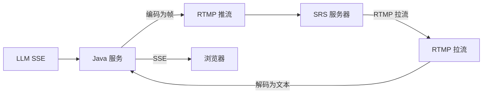

# CSDN 文章模板：RTMP 承载大模型流式输出（内网可用）

## 1. 背景与痛点
- 内网环境限制：只能通过 RTMP/SRS 走视频通道，HTTP(S) 直连大模型或 WebSocket 受限
- 目标：让大模型的流式输出像“打字机”一样实时展示，并可回传给前端
- 难点：视频编码是有损的，如何保证文本不丢不乱；以及如何在内网稳定不掉线

## 2. 整体方案
- 上游：调用大模型兼容模式接口（SSE 流式）
- 中间层：将每个流式 chunk 编码为视频帧（像素块编码），推到 SRS（RTMP）
- 下游：从 SRS 拉流，解码回文本，通过 SSE 推送到浏览器页面展示

建议配一张架构图（可用 mermaid）：

## 3. 关键实现点
- 像素块编码：把 bit 写进固定大小的像素块，增强抗 H.264 损耗
- 编解码协议：帧头 + payload（长度校验），保证误码时能丢弃坏帧
- 连接编排：先拉流成功再触发 LLM 请求，避免“先推后拉”丢首帧
- 收尾排空：基于空闲时间排空停流，减少尾部丢帧与断流

## 4. 配置与部署
- 使用外部 config.txt 覆盖默认 app-config.txt
- 不要把 api.key 提交到仓库，建议通过环境变量注入
- 可执行包选择：只用带依赖的大包（非 original 瘦包）

## 5. 踩坑与排障
- OpenH264 分辨率上限：8K 会初始化失败
- 推拉分辨率不一致：解码长期无输出
- BLOCK_SIZE 太小 + CRF 太高：帧头误码导致大量帧被丢弃
- SSE/RTMP 的尾部问题：固定 sleep 易提前关流，需排空策略

## 6. 效果与提效指标（示例写法）
- 内网可用性：断流/刷新才显示 → 稳定实时展示
- 调参效率：从改代码重打包 → 只改 config.txt 即可切换参数与环境
- 排障效率：日志可观测（推流发送/拉流解码/排空停流），定位时间明显缩短

## 7. 源码与使用说明
- GitHub 地址：<填写你的仓库链接>
- README：给出一键构建、运行、配置与常见问题
